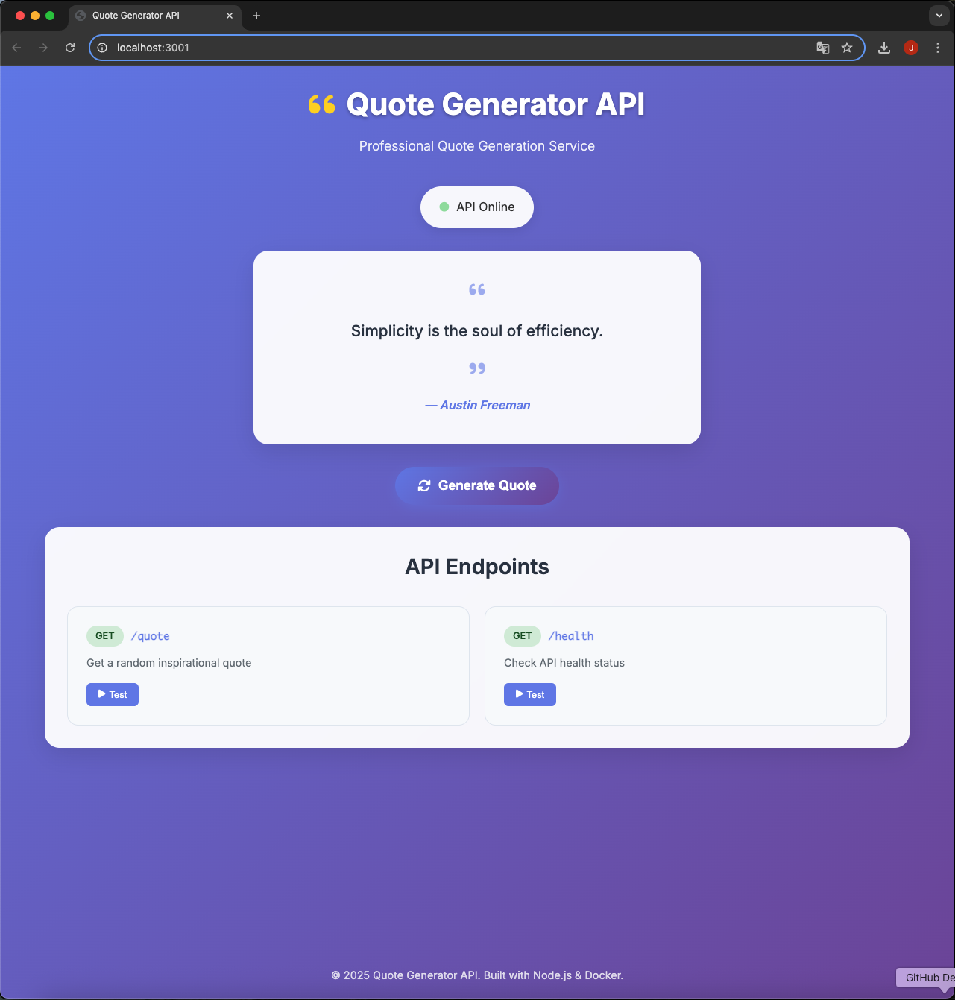
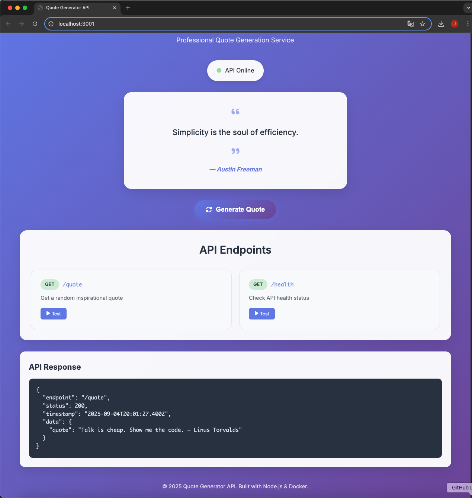
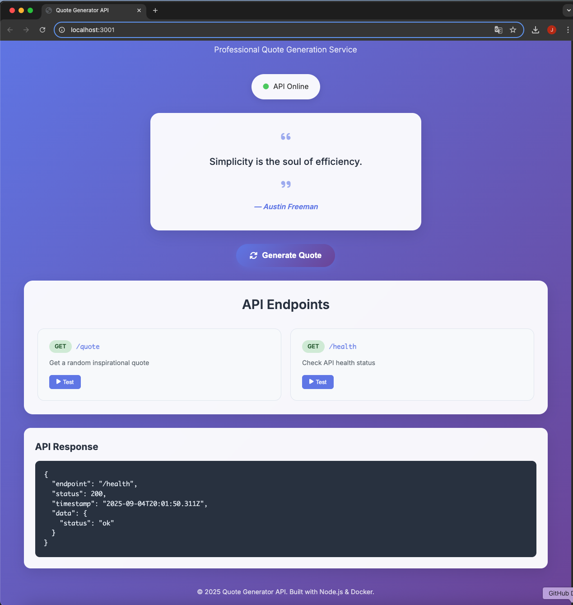

# Quote Generator API

A professional Node.js Express API with beautiful web interface that returns random inspirational quotes.

## Features

✨ **Modern Web Interface**: Beautiful, responsive UI with glassmorphism design  
✨ **Real-time API Status**: Live monitoring of API health  
✨ **Interactive Quote Generation**: One-click random quote generation  
✨ **API Testing Tools**: Built-in endpoint testing with JSON response display  
✨ **Docker Ready**: Complete containerization with Docker support  

## API Endpoints

- `GET /` → Beautiful web interface
- `GET /quote` → `{ "quote": "..." }`
- `GET /health` → `{ "status": "ok" }`

## Quick Start

### Option 1: Docker (Recommended)
```bash
# Build Docker image
docker build -t quote-api:local .

# Run container
docker run -d --name quote-api -p 3001:3000 quote-api:local

# Access web interface
open http://localhost:3001
```

### Option 2: Local Development
```bash
# Install dependencies
npm install

# Start server
npm start

# Access web interface
open http://localhost:3000
```

## Web Interface

Visit `http://localhost:3001` (Docker) or `http://localhost:3000` (local) to access:

- 🎨 **Professional UI**: Modern design with animations
- 📊 **API Status Monitor**: Real-time health check
- 🎲 **Quote Generator**: Interactive quote generation
- 🧪 **API Testing**: Test endpoints directly from browser
- 📋 **Response Viewer**: Formatted JSON responses

### Screenshots

<div align="center">


*Main web interface with API status monitoring*


*Quote generation and API testing features*


*JSON response viewer and endpoint testing*

</div>

## Docker Management

```bash
# View running containers
docker ps

# Stop container
docker stop quote-api

# Remove container
docker rm quote-api

# Remove image
docker rmi quote-api:local

# View logs
docker logs quote-api
```

## Docker Hub Deployment (Optional)

```bash
# Login to Docker Hub
docker login

# Set your username
export DOCKER_USER=your-username

# Tag image
docker tag quote-api:local $DOCKER_USER/quote-generator-api:v1

# Push to Docker Hub
docker push $DOCKER_USER/quote-generator-api:v1

# Run on another machine
docker run -p 3001:3000 $DOCKER_USER/quote-generator-api:v1
```

## Project Structure

```
junbeom-sre-docker-quote-project/
├── src/
│   ├── server.js          # Express server
│   └── quotes.js          # Quote database
├── public/
│   ├── index.html         # Web interface
│   ├── styles.css         # Modern styling
│   └── script.js          # Interactive features
├── package.json           # Dependencies
├── Dockerfile            # Container configuration
└── README.md             # This file
```

## Technologies Used

- **Backend**: Node.js, Express
- **Frontend**: HTML5, CSS3, JavaScript (ES6+)
- **Styling**: Glassmorphism, CSS Grid, Flexbox
- **Icons**: Font Awesome
- **Fonts**: Inter (Google Fonts)
- **Container**: Docker (node:20-alpine)

## Notes

- Default container port: 3001 (host) → 3000 (container)
- Default local port: 3000
- Port can be changed with PORT environment variable
- Only express dependency required
- Responsive design for mobile/tablet/desktop